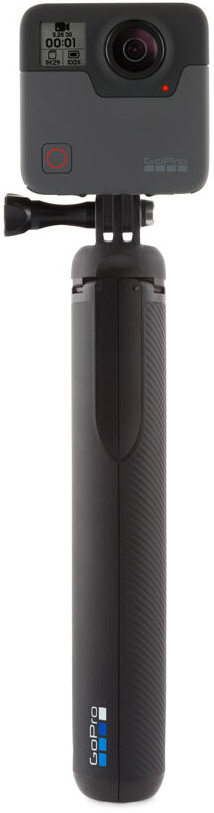

| chapter: Sissejuhatus
| section: Alustame
| theme: blue
| padding: 0

<panorama src="./img/pano.jpg" rotation="0 60 0" tint="hsl(30, 80%, 50%)"  />

    <h1>360° kaamera kasutamine</h1>
    <h3 style="margin-top:0">GoPro Fusion näitel</h3>

<f-next-button style="position:fixed; left:15vmin; bottom:15vmin;" title="Alustame" />

---

| section: Kursuse teemad
| rows: auto
| 1 1 1 1 1 1
| 2 2 3 3 4 4
| 5 5 5 6 6 6

## Kursuse teemad

-

### 1. Kaamera

- GoPro Fusion kaamerast
- seadistamine
- juhtimine mobiiliäpiga
- failide transport

-

### 2. 360° fotod

- seadistamine ja pildistamine
- piltide järeltöötlus
- virtuaaltuuride loomine

-

### 3. 360° video

- seadistamine ja filmimine
- pisut helist
- monteerimine Adobe programmidega

-

<blockquote>
    
360° kaamera on seade, mis pildistab või filmib samaaegselt **kõike ümberringi toimuvat**. Tänu sellele on vaatajale enamasti tagatud parem nn kohaloleku tunne. Kuna 360-kaamera salvestab kõike meie ümber, saab vaataja keerulisemate protsesside jälgimisel **ise valida, millele keskenduda** või materjali mitmekordsel vaatamisel keskenduda protsessi **erinevatele osadele**. Või siis saame meie **montaaži käigus otsustada**, mida vaatajale näidata ja mida mitte. Samuti on hiljem montaaži käigus võimalik võrrelda samal hetkel **mitmes eri suunas** toimunut.

</blockquote>

-

<blockquote>

## 💬

Kursuse läbimiseks on vajalik piisav **inglise keele oskus**, et tutvuda lingitud materjalide, juhendite ja õppevideotega. Samuti on inglise keelsed kasutatava tarkvara kasutajaliidesed.

</blockquote>

---

| chapter: Kaamerast
| section: GoPro Fusion 360
| 1 3
| 2 3
| cols: 3fr 2fr

## GoPro Fusion

Käesolev õppematerjal baseerub GoPro Fusion kaameral, mis meil kasutada on. Samas ei ole konkreetne kaamera mudel väga oluline &ndash; tööpõhimõtted ja -võtted on laias laastus sarnased ka suurema osa teiste analoogsete kaameratega. 

Kuna GoPro keskendub nn action- ja spordikaamerate tootmisele, on tegemist üsna vastupidava ja lihtsa seadmega. Nagu ikka, on kaamera kõige õrnemaks detailiks läätsed. 360-kaamerate eripära tõttu tungivad need korpusest "kalasilmana" esile, mistõttu on **oluline jälgida kaamera asendit** kui see ilma vutlarita kõvale pinnale asetada.

&nbsp;

<f-image src="./img/gopro-maintenance.png" style="--image-size:contain" />

&nbsp;

Kaamera küljes on enamasti ka **kolmjalg**, millele saab seadme mugavalt asetada, näiteks laadimise ja failide arvutisse transportimise ajaks. Kõrvalasuval pildil on kolmjalg suletuna. 

-

#### &nbsp;

-

<figure style="display:flex; flex-direction:column; justify-content:center; align-items:center; margin:0; position:sticky; top:35vh;">
  
</figure>

---

| section: Videotutvustus
| 1 2
| 3 2
| cols: 2fr 3fr

## Fusioni võima&shy;lused ja tehni&shy;lised para&shy;meetrid

Ilmselt ei ole mõtet kaamera tehnilistesse üksikasjadesse siin eraldi väga pikalt süveneda, sest oma ala asjatundjad on seda meist palju paremal tasemel teinud. Seega laseme parem neil rääkida. Siia on lisatud üks video, ent põhjalikumal huvilisel tasub muidugi omal käel lisa otsida.

-

<f-video src="https://www.youtube.com/watch?v=xqMfYKNyVNo" />

-

<blockquote>

### 📥

Siit leiab ka üldise <f-link to="https://gopro.com/content/dam/help/fusion/manuals/Fusion_UM_ENG_REVC.pdf">kaamera kasutusjuhendi</f-link> kõigi seadetega. *(pdf fail, inglise keeles)*

</blockquote>

---

| section: Seadistamine
| 1 2
| cols: 1fr 2fr

## Fusioni seadis&shy;tamine

Kaamera korpusel on kaks nuppu,  [mode] ja  [shutter]. 

[Mode] nupp on kaamera sisse-välja lülitamiseks ja menüüdes liikumiseks. [Shutter] on päästik pildistamiseks ja menüüdes valikute kinnitamiseks. Fusionit on võimalik nende kahe nupu abil seadistada. 

-

    <iframe src="https://www.youtube.com/embed/rctiaH1N8nc?start=262" frameborder="0" allow="accelerometer; autoplay; encrypted-media; gyroscope; picture-in-picture" allowfullscreen ></iframe>

<!-- <f-video src="https://www.youtube.com/watch?v=rctiaH1N8nc?t=262" /> -->
<!-- <f-video src="https://www.youtube.com/watch?v=yYM_0tYLuGs" /> -->

---

| section: Mobiilirakendused
| 1 2
| cols: 1fr 2fr

## Mobiili&shy;rakendused

Nuppude abil Fusioni seadistamine on küll lollikindel, aga üsna tüütu protsess, eriti kui seda tihti teha vaja on. Siin tulevad meile appi GoPro mobiilirakendused. 

<blockquote>

Androidi ja iOS-i rakenduste lingid leiame  <f-link to="https://gopro.com/en/ee/shop/softwareandapp">GoPro veebist</f-link>

</blockquote>

Peale rakenduste installeerimist ja kaameraga ühendamist saab kaamerat juhtida telefoni abil. Nagu ikka, jätaks täpsemad juhised suurematele asjatundjatele (videos)

-

    <iframe src="https://www.youtube.com/embed/rctiaH1N8nc" frameborder="0" allow="accelerometer; autoplay; encrypted-media; gyroscope; picture-in-picture" allowfullscreen ></iframe>

&nbsp;

Lisaks on <f-link to="https://youtu.be/DBqPUuQQb1Y?t=655">siin üks video</f-link>, kus käsitletakse pisut täpsemalt telefoni ja kaamera esmakordset ühendamist.
